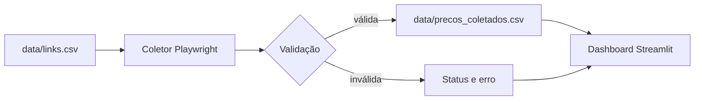

<div align="center">

# 🎮 Radar GPU Gamer BR

### Compare GPUs por preço, desempenho e custo-benefício em um só lugar.

[](https://www.python.org/)
[](https://streamlit.io/)
[](https://github.com/fabioconceicao22/radar-gpu-gamer-br/actions/workflows/ci.yml)
[](LICENSE)

</div>

## Sobre o projeto

O **Radar GPU Gamer BR** é um dashboard em Python e Streamlit que centraliza ofertas e ajuda a encontrar placas de vídeo com melhor relação entre preço e desempenho. Um coletor automatizado pesquisa lojas brasileiras, valida os resultados e atualiza a base pelo GitHub Actions.

> [!IMPORTANT]
> Preços, estoque e frete podem mudar. Confirme sempre as condições diretamente na loja antes da compra.

## ✨ Recursos

- pesquisa por GPU ou modelo;
- filtros por marca, loja, VRAM, preço e origem;
- ordenação por preço, desempenho, desconto ou score;
- médias raster e ray tracing rastreáveis para 1080p e 1440p Ultra;
- Índice Radar com pesos publicados para cada perfil de uso;
- gráficos interativos e temas claro/escuro;
- coleta por JSON-LD, seletores específicos e texto da página;
- validação de URLs, produtos e faixas de preço;
- atualização automática duas vezes ao dia.

## 🧰 Tecnologias

| Área | Tecnologias |
| --- | --- |
| Aplicação | Python, Streamlit |
| Dados | Pandas, CSV |
| Visualização | Plotly |
| Automação web | Playwright |
| Integração contínua | GitHub Actions |

## 📊 Metodologia de desempenho

Os números de FPS são médias da **GPU Hierarchy 2026** do Tom's Hardware em
resolução nativa e preset Ultra, sem upscaling ou geração de quadros. A base
versionada em [`data/desempenho_gpus.csv`](data/desempenho_gpus.csv) registra a
data de consulta, a fonte do benchmark e a ficha técnica de cada fabricante.

O **Índice Radar** é relativo às GPUs monitoradas e combina desempenho, preço,
eficiência, VRAM e, no perfil de jogos com streaming, ray tracing e suporte a
encode AV1. Os pesos ficam publicados em [`desempenho.py`](desempenho.py).
Assim, o ranking pode mudar quando uma oferta muda, mesmo que o benchmark seja
o mesmo.

- [resultados da GPU Hierarchy 2026](https://www.tomshardware.com/reviews/gpu-hierarchy%2C4388.html);
- [metodologia, jogos e bancada de testes](https://www.tomshardware.com/pc-components/gpus/the-great-bench-gpu-retest-begins-how-were-testing-for-our-gpu-hierarchy-in-2026-and-why-upscaling-and-framegen-are-still-out).

> FPS são médias comparativas, não uma previsão exata para todos os PCs. CPU,
> drivers, memória, jogo, API gráfica e configurações podem alterar o resultado.

## 🏗 Arquitetura

```text
radar-gpu-gamer-br/
├── .github/workflows/       # CI e atualização automatizada
├── data/                    # entradas e resultados da coleta
├── tests/                   # testes automatizados
├── Radar.py                 # dashboard Streamlit
├── coletar_precos.py        # coleta, validação e persistência
└── requirements.txt
```



## 🚀 Como executar

Requer Python 3.11 ou superior e Git.

```bash
git clone https://github.com/fabioconceicao22/radar-gpu-gamer-br.git
cd radar-gpu-gamer-br
python -m venv .venv
```

```bash
# Windows
.venv\Scripts\activate

# Linux ou macOS
source .venv/bin/activate
```

```bash
python -m pip install --upgrade pip
pip install -r requirements.txt
playwright install chromium
streamlit run Radar.py
```

Para atualizar os preços manualmente:

```bash
python coletar_precos.py
```

## 📄 Formato dos dados

`data/links.csv` utiliza `;` como separador:

```csv
produto;link;loja
GeForce RTX 4060 8GB;https://exemplo.com/produto;Loja
```

## ✅ Qualidade

```bash
python -m unittest discover -s tests -v
```

A integração contínua verifica sintaxe e testes em pushes e pull requests.

## 🤝 Contribuição e segurança

Leia [CONTRIBUTING.md](CONTRIBUTING.md) antes de contribuir. Para vulnerabilidades, consulte [SECURITY.md](SECURITY.md) e não publique detalhes sensíveis em issues.

## 📜 Licença

Distribuído sob a [licença MIT](LICENSE).

## 👤 Autor

**Fabio Leite** · [GitHub](https://github.com/fabioconceicao22) · [LinkedIn](https://www.linkedin.com/in/fabio-concei%C3%A7%C3%A3o95/)

